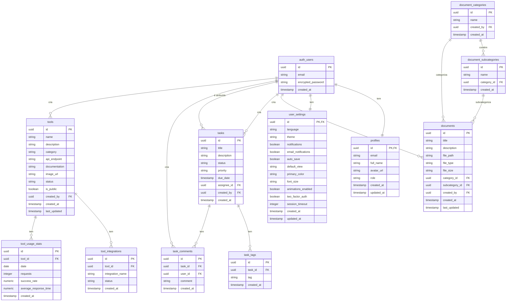

# Diagrama ER do Banco de Dados Docgeo

O diagrama abaixo representa a estrutura do banco de dados do sistema Docgeo, mostrando as tabelas e seus relacionamentos.

## Legenda

- **PK**: Chave Primária
- **FK**: Chave Estrangeira
- **||--||**: Relacionamento um-para-um
- **||--o{**: Relacionamento um-para-muitos
- **}o--o{**: Relacionamento muitos-para-muitos

## Descrição dos Relacionamentos

1. **Usuários e Configurações**:
   - Cada usuário (`auth_users`) tem um perfil (`profiles`)
   - Cada usuário tem configurações personalizadas (`user_settings`)

2. **Documentos**:
   - Categorias (`document_categories`) contêm subcategorias (`document_subcategories`)
   - Documentos (`documents`) pertencem a categorias e subcategorias
   - Usuários criam documentos

3. **Tarefas**:
   - Usuários criam tarefas (`tasks`)
   - Tarefas são atribuídas a usuários
   - Tarefas têm tags (`task_tags`) e comentários (`task_comments`)
   - Usuários criam comentários em tarefas

4. **Ferramentas**:
   - Usuários criam ferramentas (`tools`)
   - Ferramentas têm integrações (`tool_integrations`)
   - Ferramentas têm estatísticas de uso (`tool_usage_stats`) 